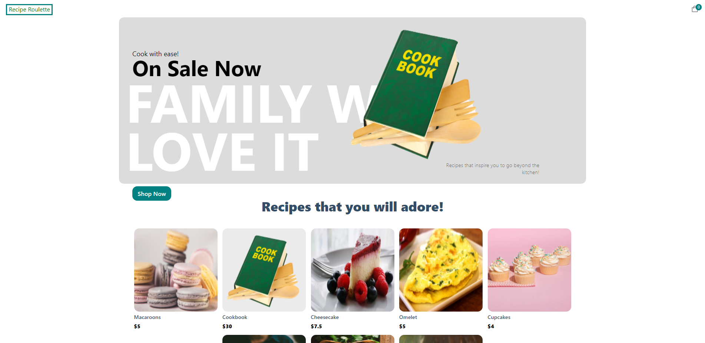

# Mock E-commerce Website

You can view my project here: https://mock-ecommerce-site.vercel.app/

## Description

This is a modern Full Stack e-commerce website that utilizes the react framework Next.js, Sanity's content management system as a backend and Stripe to perform real-time transactions.
I re-created this website from a youtube channel called JavaScript Mastery. However, I changed a some lines of code, added a purchased canceled page, and changed the photos and text used in the
final design. I created this project so I could better understand e-commerce websites and how to better market products for sale.

## Payments

Since this is just a demonstartion of an actual e-commerce website, transactions will not be tracked by Stripe. However, in order to demonstrate the success page, the user can enter this
in order to test the functionality of the e-commerce website:

Your email
Credit/Debit: 4242424242424242
04/24 242
John Doe
United States
12345

## Conslusion

This project was difficult to understand but rewarding to develop because of the new features that I had to implement along the way. Next.js proved to be difficult to learn but I feel as though
my understanding of React has improved.

## Credit

Youtube Channel - JavaScript Mastery
